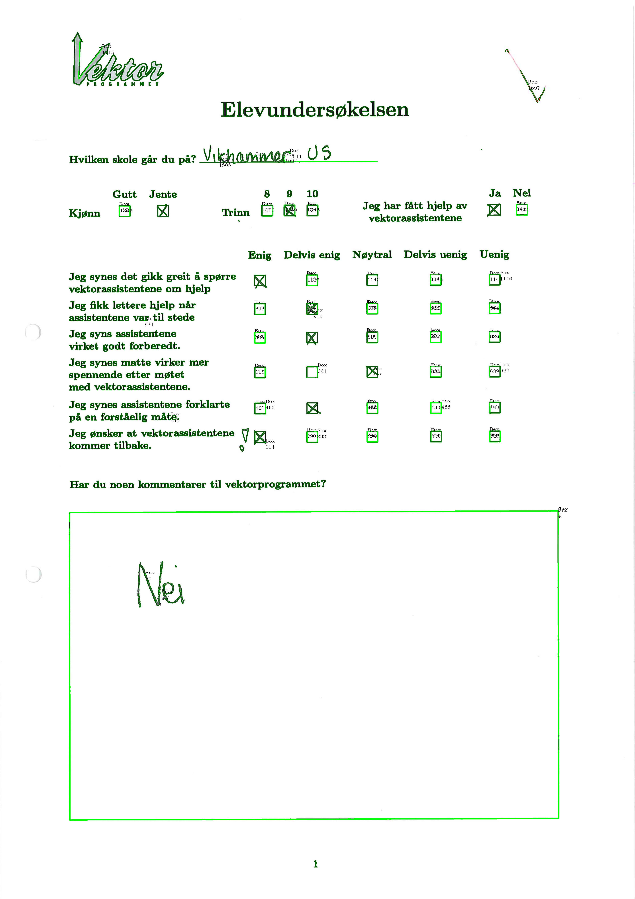
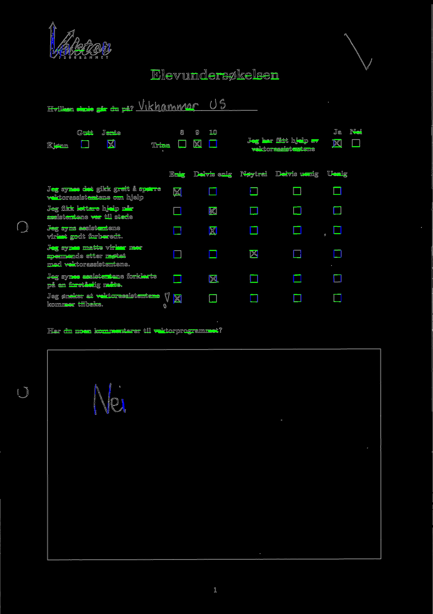
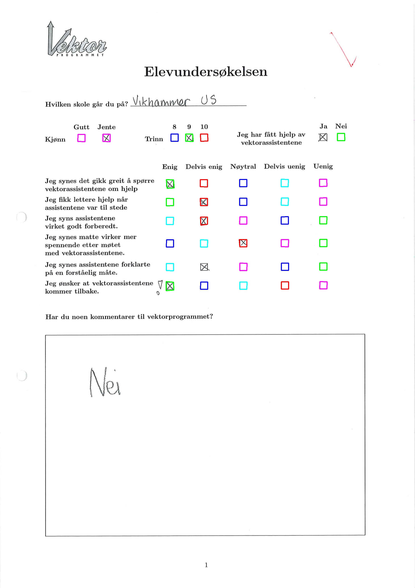

# Survey scanner for vektorprogrammet
> Work in progress

The current approach is to detect boxes on the page and see if they're checked or not. We will do this with opencv methods and square detection.

Current progress:

Progress after tweaking the parameters somewhat and adding an erode/dilate step:

Box lines are detected more clearly, and less of the other lines are wrongly detected.

Progress after using contours instead of `HoughLines`:

