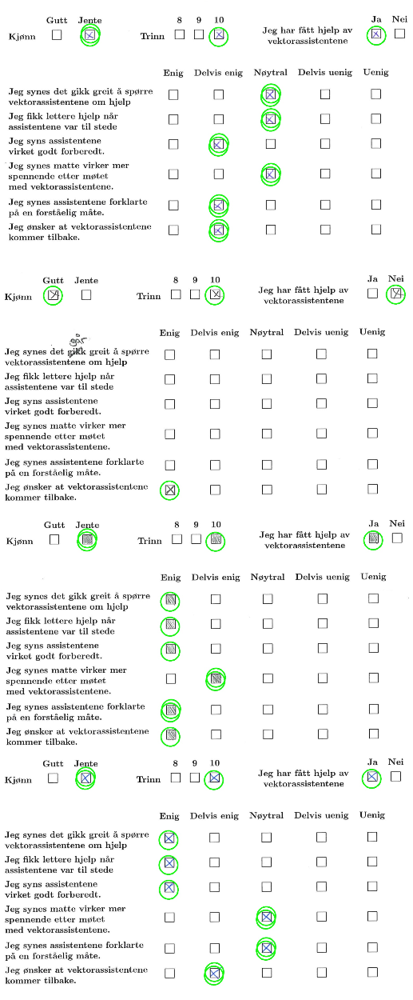

# Survey scanner for vektorprogrammet

## Dependencies
```bash
pip install all the needed packages
```

## Usage
### Running the program
The scanner takes a single pdf file and a number of expected boxes (`k`) as inputs.
```bash
./main.py inputs.pdf k
```

### Outputs: stdout, stderr
The outputs are written to `stdout` but beware, the program logs its progress to `stderr`.
To suppress the log outputs or write them to a specific file, you can do
```bash
./main.py inputs.pdf k 2>/path/to/log  # Write to log file
./main.py inputs.pdf k 2>/dev/null     # Suppress log outputs
```


## Output data structure
The data that comes out of the program is json formatted. It is a single json object, containing three lists, "boxes", "image_folder" and "pages". The image folder is the folder where images are placed.
It outputs a list of checkboxes it has found, with ids and coordinates. e.g.
#### Box coordinates ("boxes")
```json
{
  "0": {
    "x": 1214,
    "y": 908
  },
  "1": {
    "x": 1418,
    "y": 1151
  },
  "2": {
    "x": 845,
    "y": 1373
  },
}
```
In addition, a list of all the pages, with corresponding lists of their checked boxes are outputted. e.g.
#### Pages ("pages")
```json
[
  {
    "boxes": {
      "0": true,
      "3": true,
      "5": true,
      "12": true,
      "14": true,
      "17": true,
      "20": true,
      "22": true,
      "27": true,
      "28": true
    },
    "page": 1
  },
]
```

## Some implementation caveats
This implementation works best if the input pdf is of some length.
When the boxes are detected, they are approximated by a 4 edged polygon which has to meet some criteria to be regarde as a box (i.e. they must be mostly square).
Big check marks that go outside the box boundaries often trip this detection up, meaning that for every page, a few boxes go undetected.
To mitigate this, the program takes into account all the pages when determining where the boxes are, and hence the pdf must be of some size before we can ensure that all boxes are detected.

## Results
The system correctly identifies checked boxes.



## HoughLines vs contours

We first attempted to use HoughLines to detect the boxes,
but contour approximation turned out to be much more affective, as can be seen below.

Attempt 1, HoughLines:


Attempt 2, using contour detection:

